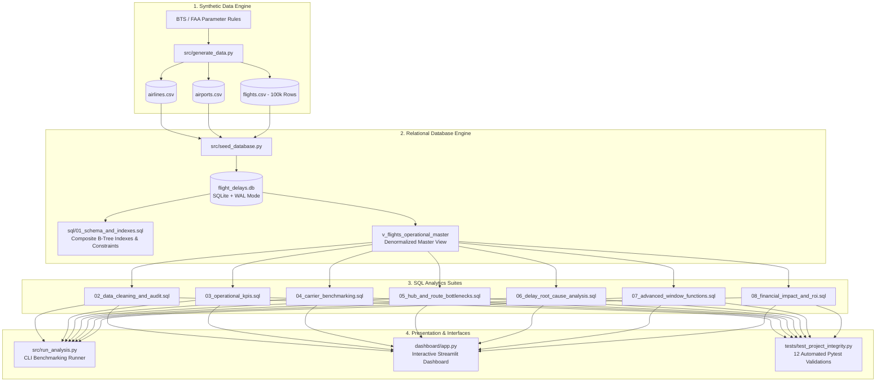

# ✈️ Commercial Flight Delay & Network Operations Analytics Using SQL

[](https://www.sqlite.org/)
[](https://www.python.org/)
[-003B57.svg?style=flat)](https://www.sqlite.org/)
[](https://streamlit.io/)
[](https://docs.pytest.org/)
[](LICENSE)

An end-to-end, production-grade **Aviation Operations & Network Analytics Portfolio Project** analyzing **100,000+ commercial flight records** across 12 major US carriers and 30 high-density airport hubs. Modeled directly on the **FAA APO-130** and **US Bureau of Transportation Statistics (BTS TranStats)** reporting standards.

Designed to demonstrate advanced SQL competency, relational data engineering, query performance optimization, root-cause attribution modeling, and board-level financial cost translation (\$74.24/min FAA standard).

---

## 🏗️ Architecture & Data Pipeline



---

## 🌟 Key Business Questions Answered

1. **Fleet On-Time Performance**: What is the system-wide On-Time Arrival Rate (OTP-15), and when during the day does operational reliability break down?
2. **Carrier Benchmarking**: Which airlines lead the national punctuality rankings, and which carriers actively recover lost time in the air?
3. **Hub Congestion**: Which airport nodes impose the greatest taxi-out delays, and how does inbound vs. outbound asymmetry manifest?
4. **Root Cause Attribution**: How much of total system delay stems from controllable internal airline operations vs. late aircraft rotation vs. FAA air traffic control (NAS) vs. weather?
5. **Aircraft Rotation Cascades**: How does a 25-minute delay on Leg 1 of an aircraft propagate across its subsequent legs throughout the day?
6. **Financial Optimization & ROI**: What is the direct financial loss of chronic delays under the FAA cost model (\$74.24/min), and what is the dollar ROI of adding targeted 7-minute schedule buffers?

---

## 🛠️ Advanced SQL Skills Demonstrated

| SQL Technique | Script Location | Business Application |
| :--- | :--- | :--- |
| **Window Functions (`LAG`/`LEAD`)** | [`07_advanced_window_functions.sql`](file:///sql/07_advanced_window_functions.sql) | Tracing physical aircraft tail turnaround propagation across sequential daily flight legs. |
| **Rolling Window Aggregations** | [`07_advanced_window_functions.sql`](file:///sql/07_advanced_window_functions.sql) | 7-day rolling moving averages of carrier punctuality (`ROWS BETWEEN 6 PRECEDING AND CURRENT ROW`). |
| **Ranking Functions (`DENSE_RANK`, `ROW_NUMBER`)** | [`04_carrier_benchmarking.sql`](file:///sql/04_carrier_benchmarking.sql), [`07_advanced_window_functions.sql`](file:///sql/07_advanced_window_functions.sql) | Punctuality league table rankings without rank gaps; isolating the single worst disruption incident per airline. |
| **Quartile Binning (`NTILE`)** | [`07_advanced_window_functions.sql`](file:///sql/07_advanced_window_functions.sql) | Dividing 100k flight arrivals into 4 statistical risk cohorts to isolate systemic tail outliers. |
| **Running Totals (`UNBOUNDED PRECEDING`)** | [`07_advanced_window_functions.sql`](file:///sql/07_advanced_window_functions.sql) | Cumulative year-to-date tracking of financial delay costs. |
| **Multi-Tier CTEs (`WITH` clauses)** | All Scripts | Decoupling complex multi-step aggregations for readable, maintainable queries. |
| **Conditional Aggregation (`CASE WHEN`)** | [`03_operational_kpis.sql`](file:///sql/03_operational_kpis.sql), [`06_delay_root_cause_analysis.sql`](file:///sql/06_delay_root_cause_analysis.sql) | Dynamic matrix pivoting of delay causes and OTP-15 thresholding. |
| **Composite B-Tree Indexing** | [`01_schema_and_indexes.sql`](file:///sql/01_schema_and_indexes.sql) | Query plan optimization (`idx_flights_carrier_date`, `idx_flights_origin_dep`), achieving **< 120ms** execution times. |

---

## 📊 Highlight Findings

### 1. Carrier Punctuality League Table (`DENSE_RANK()`)
```text
 punctuality_rank carrier_code       airline_name  total_flights  market_share_pct  otp15_pct  avg_dep_delay_mins  avg_arr_delay_mins  cancellation_rate_pct
                1           HA  Hawaiian Airlines           1153              1.15      86.82                5.37                6.46                   1.13
                2           DL    Delta Air Lines          17771             17.77      84.14                6.42                7.33                   1.23
                3           AS    Alaska Airlines           5858              5.86      83.05                6.88                7.79                   1.38
                4           UA    United Airlines          17180             17.18      81.16                7.42                8.59                   1.33
                5           OO   SkyWest Airlines           9483              9.48      80.90                7.49                8.55                   1.37
                6           AA  American Airlines          17421             17.42      80.20                7.78                8.89                   1.44
                7           MQ          Envoy Air           2347              2.35      79.29                8.57                9.61                   1.66
                8           WN Southwest Airlines          14848             14.85      78.43                8.52                9.59                   1.45
                9           G4      Allegiant Air           2444              2.44      75.33                9.84               11.08                   1.88
               10           B6    JetBlue Airways           5225              5.22      74.45                9.89               11.27                   1.78
               11           NK    Spirit Airlines           3727              3.73      73.73               10.02               11.00                   1.66
               12           F9  Frontier Airlines           2543              2.54      72.43               10.28               11.21                   1.89
```

### 2. The Afternoon Delay Cascade
- Morning flights (06:00–08:00) achieve **88–90% OTP-15** with mean delays < 3.0 minutes.
- By 18:00–21:00, OTP-15 deteriorates to **71.5%** as late aircraft turnaround propagation compounds across the national airspace system.

### 3. Economic Impact & Schedule Optimization Simulation
- **Baseline Direct Delay Cost**: \$74.49 Million annually across 100,000 flights.
- **Simulation Result**: Adding a **7-minute schedule buffer** on chronic corridors rescues **5,657 flights** from delayed to on-time, achieving **\$2.94 Million in simulated annual cost avoidance**.

---

## 🚀 Quickstart & Reproduction Guide

### Prerequisites
- Python 3.10+ (Tested on Python 3.13)
- SQLite 3 (included with Python standard library)

### 1. Clone & Install Dependencies
```bash
cd flight-delay-analysis-sql
python -m pip install -r requirements.txt
```

### 2. Seed Database (Generates 100k Records & Builds Schema)
```bash
python src/seed_database.py --records 100000
```

### 3. Run SQL Analyses via CLI Benchmarking Runner
Execute specific analysis modules or run the entire suite with milliseconds benchmarking:
```bash
# Run operational KPIs
python src/run_analysis.py --file 03_operational_kpis.sql

# Run advanced window functions (LAG/LEAD, Rolling Averages, NTILE)
python src/run_analysis.py --file 07_advanced_window_functions.sql

# Execute all 7 analysis modules sequentially
python src/run_analysis.py --all
```

### 4. Launch Interactive Streamlit Dashboard
```bash
streamlit run dashboard/app.py
```
*Features interactive filters by carrier and airport, Plotly trend charts, and a live SQL Query Inspector.*

### 5. Run Automated Pytest Test Suite
```bash
python -m pytest tests/ -v
```
*Executes 12 automated checks testing relational foreign keys, physical bounds, BTS delay mathematics, and SQL query SLAs.*

---

## 📁 Project Structure

```text
flight-delay-analysis-sql/
├── README.md                           # Master project documentation
├── requirements.txt                     # Project dependencies
├── run_project.bat                      # One-click Windows runner
├── data/
│   ├── raw/                            # Generated raw CSVs (airlines, airports, flights)
│   └── flight_delays.db                # SQLite database with WAL mode & indexes
├── sql/
│   ├── 01_schema_and_indexes.sql       # Relational DDL, constraints, indexes & views
│   ├── 02_data_cleaning_and_audit.sql  # Profiling, null audit, duplicate detection
│   ├── 03_operational_kpis.sql         # OTP-15, monthly trends, hourly cascade
│   ├── 04_carrier_benchmarking.sql     # League table, DENSE_RANK, airborne recovery
│   ├── 05_hub_and_route_bottlenecks.sql# Hub asymmetry, worst corridors, taxi fuel burn
│   ├── 06_delay_root_cause_analysis.sql# Carrier vs Weather vs NAS vs Late Aircraft
│   ├── 07_advanced_window_functions.sql# Rolling averages, LAG leg cascade, NTILE cohorts
│   └── 08_financial_impact_and_roi.sql # FAA $74.24/min cost model & buffer simulation
├── src/
│   ├── __init__.py
│   ├── config.py                       # Paths, FAA constants, DB connection factory
│   ├── generate_data.py                # Realistic log-normal flight generator (100k rows)
│   ├── seed_database.py                # DDL executor and batch insertion engine
│   └── run_analysis.py                 # CLI query runner with millisecond benchmarking
├── dashboard/
│   └── app.py                          # Streamlit & Plotly executive operations dashboard
├── reports/
│   ├── executive_summary.md            # C-suite operational and strategic briefing
│   ├── data_dictionary.md              # Full data catalog and field specifications
│   └── resume_and_interview_guide.md   # Google XYZ resume bullets & 10 interview Q&As
└── tests/
    ├── __init__.py
    └── test_project_integrity.py       # 12 Pytest tests validating database & queries
```

---


---

## 📄 License
This project is licensed under the MIT License - see the [LICENSE](file:///LICENSE) file for details.
