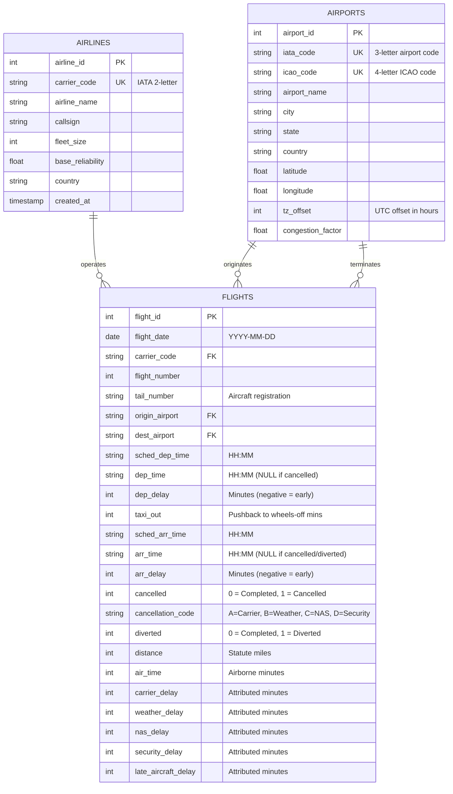

# 📖 Data Dictionary: Commercial Flight Delay Intelligence

This document defines the schema, table relationships, data types, and business rules for the **Flight Delay Analysis SQL Project**, aligned with the **FAA APO-130** and **Bureau of Transportation Statistics (BTS TranStats)** reporting specifications.

---

## 🏛️ Entity-Relationship Overview

---

## 1. Table: `airlines` (Dimension)

Stores master carrier identity, fleet capacity, and baseline reliability parameters.

| Column Name | Type | Constraints | Description |
| :--- | :--- | :--- | :--- |
| `airline_id` | `INTEGER` | `PRIMARY KEY AUTOINCREMENT` | Surrogate primary key. |
| `carrier_code` | `TEXT` | `NOT NULL, UNIQUE` | Standard IATA 2-letter airline code (e.g., `DL`, `AA`, `UA`, `WN`). |
| `airline_name` | `TEXT` | `NOT NULL` | Full legal commercial entity name (e.g., `Delta Air Lines`). |
| `callsign` | `TEXT` | `NULLABLE` | Official FAA air traffic control radio callsign (e.g., `DELTA`). |
| `fleet_size` | `INTEGER` | `DEFAULT 0, CHECK >= 0` | Approximate operational mainline aircraft fleet count. |
| `base_reliability`| `REAL` | `CHECK BETWEEN 0.0 AND 1.0` | Historical baseline probability of on-time operational dispatch. |
| `country` | `TEXT` | `DEFAULT 'USA'` | Country of airline operating certificate. |
| `created_at` | `TIMESTAMP` | `DEFAULT CURRENT_TIMESTAMP` | Row ingestion timestamp. |

---

## 2. Table: `airports` (Dimension)

Stores master airport terminal coordinates, time zones, and air traffic congestion ratings.

| Column Name | Type | Constraints | Description |
| :--- | :--- | :--- | :--- |
| `airport_id` | `INTEGER` | `PRIMARY KEY AUTOINCREMENT` | Surrogate primary key. |
| `iata_code` | `TEXT` | `NOT NULL, UNIQUE` | 3-letter IATA code (e.g., `ATL`, `ORD`, `DFW`, `JFK`). |
| `icao_code` | `TEXT` | `NOT NULL, UNIQUE` | 4-letter ICAO location indicator (e.g., `KATL`, `KORD`). |
| `airport_name` | `TEXT` | `NOT NULL` | Official public facility name. |
| `city` | `TEXT` | `NOT NULL` | Primary metropolitan municipality served. |
| `state` | `TEXT` | `NOT NULL` | US two-letter postal state code. |
| `country` | `TEXT` | `DEFAULT 'USA'` | Country sovereign jurisdiction. |
| `latitude` | `REAL` | `CHECK -90.0 TO 90.0` | Geodetic latitude coordinate in decimal degrees. |
| `longitude` | `REAL` | `CHECK -180.0 TO 180.0`| Geodetic longitude coordinate in decimal degrees. |
| `tz_offset` | `INTEGER` | `DEFAULT -5` | Standard UTC timezone hour offset. |
| `congestion_factor`| `REAL` | `DEFAULT 1.0, CHECK > 0` | Relative peak-hour runway congestion index relative to national baseline. |

---

## 3. Table: `flights` (Fact)

Grain: One record per scheduled commercial passenger flight leg.

| Column Name | Type | Constraints | Description |
| :--- | :--- | :--- | :--- |
| `flight_id` | `INTEGER` | `PRIMARY KEY` | Unique integer flight record identifier. |
| `flight_date` | `TEXT` | `NOT NULL` | Flight departure date formatted as `YYYY-MM-DD`. |
| `carrier_code` | `TEXT` | `FK -> airlines(carrier_code)` | Operating carrier. |
| `flight_number` | `INTEGER` | `NOT NULL` | Commercial published flight number (e.g., `1942`). |
| `tail_number` | `TEXT` | `NOT NULL` | Aircraft FAA tail registration number (e.g., `N102AA`). |
| `origin_airport` | `TEXT` | `FK -> airports(iata_code)` | Origin airport. |
| `dest_airport` | `TEXT` | `FK -> airports(iata_code)` | Scheduled destination airport. |
| `sched_dep_time`| `TEXT` | `NOT NULL` | Computer Reservation System (CRS) scheduled departure time (`HH:MM`). |
| `dep_time` | `TEXT` | `NULLABLE` | Actual gate pushback time (`HH:MM`). NULL if cancelled. |
| `dep_delay` | `INTEGER` | `DEFAULT 0` | Difference in minutes between actual and scheduled departure. Negative indicates early pushback. |
| `taxi_out` | `INTEGER` | `DEFAULT 0` | Duration from gate pushback to runway wheels-off in minutes. |
| `sched_arr_time`| `TEXT` | `NOT NULL` | Scheduled gate arrival time (`HH:MM`). |
| `arr_time` | `TEXT` | `NULLABLE` | Actual gate arrival time (`HH:MM`). NULL if cancelled or diverted. |
| `arr_delay` | `INTEGER` | `DEFAULT 0` | Difference in minutes between actual and scheduled arrival. |
| `cancelled` | `INTEGER` | `CHECK (cancelled IN (0, 1))` | Flight cancellation indicator (1 = Cancelled, 0 = Operated). |
| `cancellation_code`| `TEXT`| `CHECK ('A','B','C','D' OR NULL)` | DOT root cause code: **A**=Carrier, **B**=Weather, **C**=NAS, **D**=Security. |
| `diverted` | `INTEGER` | `CHECK (diverted IN (0, 1))` | Flight diversion to alternate airfield (1 = Diverted, 0 = Normal). |
| `distance` | `INTEGER` | `CHECK (distance > 0)` | Great circle distance between airports in statute miles. |
| `air_time` | `INTEGER` | `DEFAULT 0` | Elapsed airborne duration (wheels-off to wheels-on) in minutes. |
| `carrier_delay` | `INTEGER` | `DEFAULT 0` | Minutes attributable to aircraft maintenance, crew scheduling, baggage loading, or cleaning. |
| `weather_delay` | `INTEGER` | `DEFAULT 0` | Minutes attributable to meteorological conditions (snow, convective thunderstorm, low visibility). |
| `nas_delay` | `INTEGER` | `DEFAULT 0` | Minutes attributable to National Airspace System ground delay programs or en-route radar separation. |
| `security_delay`| `INTEGER` | `DEFAULT 0` | Minutes attributable to terminal evacuation or passenger re-screening. |
| `late_aircraft_delay`| `INTEGER`| `DEFAULT 0` | Minutes attributable to the late arrival of the previous aircraft using the same physical tail. |

---

## 4. Analytical View: `v_flights_operational_master`

Denormalized analytical reporting view joining `flights` with dimensional attributes and computed metrics:
- `is_on_time_otp15`: Binary flag (1 if non-cancelled, non-diverted, and `arr_delay < 15`).
- `is_delayed_15plus`: Binary flag (1 if non-cancelled, non-diverted, and `arr_delay >= 15`).
- `en_route_delay_delta`: Calculated as `(arr_delay - dep_delay)`. Negative indicates minutes made up during flight cruise.
- `estimated_cost_usd`: Direct aircraft operating expense calculated as `CASE WHEN arr_delay > 0 THEN arr_delay * 74.24 ELSE 0 END`.
