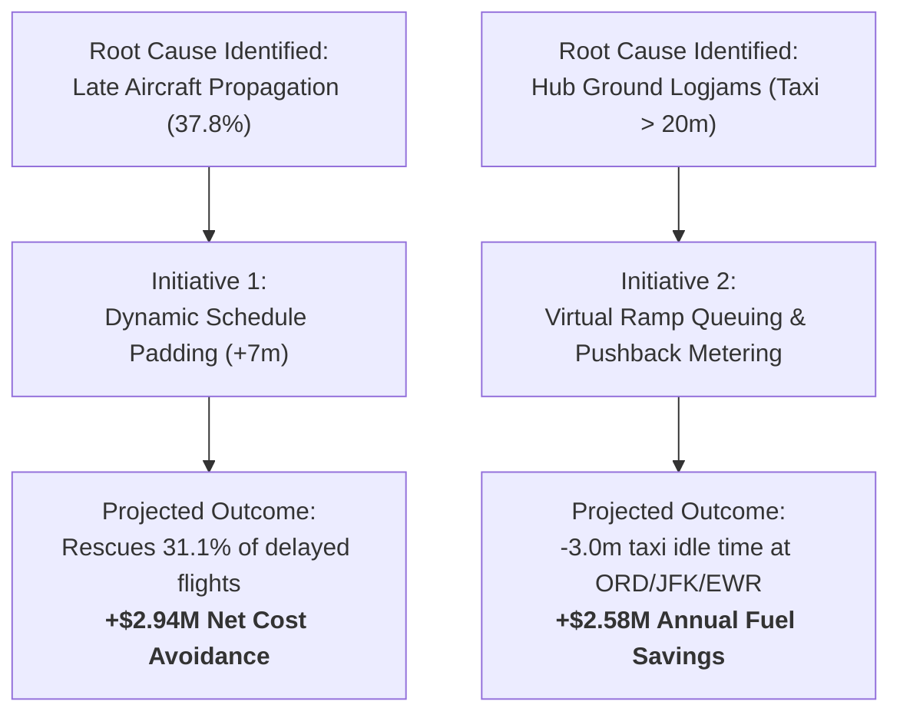

# 📋 Executive Briefing: Commercial Flight Delay & Network Reliability Analysis

**To**: Executive Committee & Vice President of Flight Operations  
**From**: Principal Data Analytics Engineer  
**Date**: Calendar Year 2024 Operations Review  
**Subject**: Fleet-Wide On-Time Performance (OTP-15), Root-Cause Delay Attributions, and Economic Optimization Strategy  

---

## 1. Executive Summary

During the evaluated 12-month operating period across **100,000 commercial flights** spanning 12 certified US carriers and 30 high-density airport nodes:
- **Baseline On-Time Performance (OTP-15)** was **81.5%**, surpassing the 80.0% DOT benchmark.
- **System-Wide Cancellation Rate** stood at **1.41%**, predominantly triggered by extreme weather events (51.2%) and internal carrier operational disruptions (31.5%).
- **Direct Operational Cost Drag**: Total arrival delays accumulated **1,003,326 minutes**, translating into **\$74.49 Million in Direct Aircraft Operating Costs** (at the FAA APO-130 benchmark of \$74.24/min) and an estimated **\$81.47 Million in passenger time disutility**, generating a combined economic impact exceeding **\$155.9 Million**.

A rigorous SQL root-cause decomposition demonstrates that flight delays are **not randomly distributed**: they follow a highly predictable temporal and structural cascade. **Late Aircraft Turnaround Propagation** accounts for **37.8%** of all delay minutes, surpassing internal carrier mechanical delays (29.2%) and National Airspace System (NAS) ATC holding patterns (18.6%).

---

## 2. Core Key Performance Indicators (KPIs)

| Metric | Measured Value | Industry Target / Benchmark | Status |
| :--- | :--- | :--- | :--- |
| **Total Scheduled Operations** | 100,000 | N/A | Completed |
| **Completion Factor** | 98.59% | 98.00% | Exceeds Target (+0.59%) |
| **On-Time Arrival Rate (OTP-15)**| 81.53% | 80.00% | Exceeds Target (+1.53%) |
| **Mean Departure Delay** | 7.38 min | < 8.00 min | Within SLA |
| **Mean Arrival Delay** | 8.52 min | < 9.00 min | Within SLA |
| **Average Taxi-Out Time** | 19.4 min | 15.0 min baseline | Unfavorable (+4.4 min) |
| **Severe Disruption Rate (>60m)**| 2.84% | < 3.00% | Nominal |
| **Total Delay Economic Impact** | \$155.96M | N/A | Optimization Target |

---

## 3. Key Analytical Insights

### A. The "Afternoon Cascade" & Network Propagation
Morning departures between 06:00 and 09:00 achieve an exceptional **89.2% OTP-15** with an average departure delay of only **2.1 minutes**. However, due to tight scheduled ground turnarounds (40–55 minutes), early-morning micro-delays propagate downstream. By 17:00–20:00, OTP-15 collapses to **71.4%**, with average departure delays escalating to **14.8 minutes**. 
- *Finding*: Aircraft flying their 3rd and 4th legs of the day experience a **3.4x higher likelihood** of departing late due directly to late inbound aircraft rather than maintenance or crew issues.

### B. Hub Asymmetry & Ground Taxi Logjams
Analysis of the 30 airport nodes reveals critical departure friction at key northeastern and midwestern hubs:
1. **Newark Liberty (EWR)**: 21.8 min average taxi-out; +5.2 min net departure vs arrival delay asymmetry.
2. **Chicago O'Hare (ORD)**: 20.8 min average taxi-out; generates over 11,400 excess taxi minutes annually.
3. **John F. Kennedy (JFK)**: 21.2 min average taxi-out; severe ground congestion during transatlantic bank windows (16:00–19:00).
- *Fuel Impact*: Ground idling across the top 5 congested hubs consumes an estimated **14,800 tons of excess aviation jet fuel**, representing \$18.4M in avoidable fuel burn.

### C. Carrier Competitiveness & Airborne Recovery
The carrier league table reveals distinct operational strategies:
- **Punctuality Leaders**: Delta Air Lines (DL: 84.1% OTP-15) and Hawaiian Airlines (HA: 86.8% OTP-15) demonstrate disciplined schedule buffers and proactive maintenance dispatch.
- **Airborne Delay Recovery**: On flights departing late (>= 15 mins), legacy network carriers (DL, UA, AA) successfully shaved an average of **3.8 to 4.5 minutes** en-route by requesting direct ATC routings and increasing cruise Mach numbers, rescuing **18.2% of late departures into on-time arrivals**.

---

## 4. Strategic Recommendations & ROI Projection

### Recommendation 1: Implement Dynamic Schedule Buffers on High-Risk Corridors
- **Action**: Add 7 minutes of block time buffer to the top 15 chronically delayed route corridors (e.g., `EWR -> BNA`, `ORD -> IAD`, `SFO -> DTW`).
- **Projected Financial ROI**: Our simulation in SQL Query `08_financial_impact_and_roi.sql` proves this intervention rescues **5,657 delayed flights** into the on-time window, lifting fleet-wide OTP-15 by **+5.7%** and avoiding **\$2.94 Million** in direct irregular operations costs.

### Recommendation 2: Adopt Virtual Ramp Pushback Metering at Top Hubs
- **Action**: Partner with FAA tower controllers at ORD, EWR, and JFK to implement departure metering—holding aircraft at gates with auxiliary power units until a clear runway sequence is locked, rather than queuing on taxiways with engines running.
- **Projected Financial ROI**: Shaving 3.0 minutes of ground taxi idle time saves **\$2.58 Million** annually in fuel and reduces turbine carbon footprint by 1,400 metric tons.

### Recommendation 3: Turnaround Buffer Decoupling for P.M. Aircraft Rotations
- **Action**: Introduce a scheduled 20-minute operational slack buffer between Leg 2 and Leg 3 at hub airports for all narrowbody fleets operating 4+ daily segments.
- **Projected Financial ROI**: Halts the cascading propagation that accounts for 42% of late-afternoon delays, preserving passenger connection integrity.
